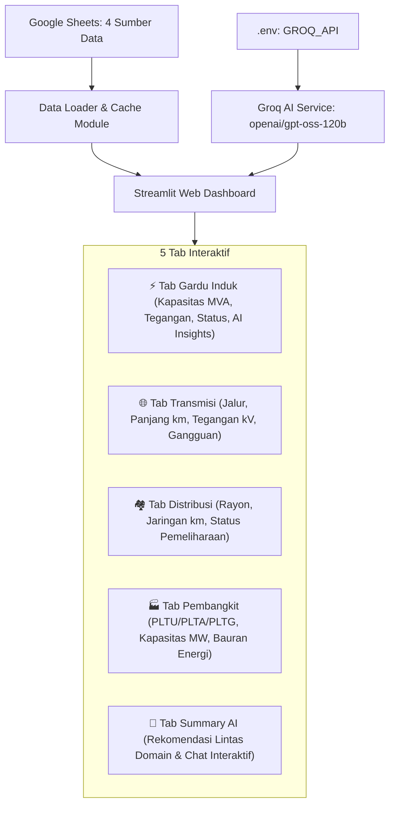

# Implementasi Dashboard Web Berbasis AI - Kelistrikan Terpadu

Membangun aplikasi dashboard web berbasis AI interaktif dan responsif berdasarkan spesifikasi [spek.md](file:///f:/DL/AI-data/spek.md) yang mengintegrasikan 4 domain data kelistrikan dari Google Sheets (Gardu Induk, Transmisi, Distribusi, Pembangkit) serta Tab Summary AI dengan integrasi Groq API (`openai/gpt-oss-120b`).

## User Review Required

> [!IMPORTANT]
> - **Framework**: Aplikasi dibangun menggunakan **Streamlit + Plotly + Pandas** dengan integrasi API Groq via Python (`openai` SDK / `groq`).
> - **Model AI**: Sesuai `spek.md`, model yang digunakan adalah **`openai/gpt-oss-120b`** pada Groq API dengan kunci API yang sudah tersedia di `.env` (`GROQ_API`).
> - **Data Sync**: Data di-fetch secara real-time dari URL Google Sheets CSV dengan caching cerdas dan tombol "Muat Ulang Data (Refresh)" untuk pembaruan instan tanpa restart.

---

## Arsitektur & Struktur Aplikasi

---

## Proposed Changes

### Core Dashboard Application

#### [NEW] [requirements.txt](file:///f:/DL/AI-data/requirements.txt)
- Menampung dependensi proyek: `streamlit`, `pandas`, `plotly`, `openai`, `python-dotenv`, `requests`.

#### [NEW] [.streamlit/config.toml](file:///f:/DL/AI-data/.streamlit/config.toml)
- Konfigurasi tema antarmuka Streamlit modern (warna tema profesional kelistrikan/energi, layout wide).

#### [NEW] [ai_service.py](file:///f:/DL/AI-data/ai_service.py)
- Modul pembungkus Groq API:
  - Inisialisasi client dari `os.getenv("GROQ_API")`.
  - Fungsi `generate_domain_insight(domain, data_summary)` untuk quick insights pada masing-masing tab.
  - Fungsi `generate_executive_summary(all_data)` untuk analisis holistik komprehensif pada Tab Summary.
  - Fitur Chat Assistant AI interaktif untuk tanya jawab langsung seputar data.

#### [NEW] [data_loader.py](file:///f:/DL/AI-data/data_loader.py)
- Modul pemuatan data Google Sheets CSV secara live & aman dengan caching `@st.cache_data`:
  - Gardu Induk (`1TNqQ_2p77uw6Acv3bGq78pV5XDkAeRZazkIsqkZUpm0`)
  - Transmisi (`1FqZQpQOOnR8oonnXWw7UlIkIX5rk1IuRLZW2VRwvvmI`)
  - Distribusi (`1F5N-BOZ3udBywzhEMbxnshpa7NXoEQzAHStwChdeQek`)
  - Pembangkit (`14Z4W20lV_ACa1ZoFMrUKc3RHzI4OGudrdLbriTBLzT4`)
  - Format data normalizer & fallback data offline lokal jika terjadi gangguan koneksi internet.

#### [NEW] [app.py](file:///f:/DL/AI-data/app.py)
- File utama dashboard:
  - **Header & Sidebar**: Ringkasan status koneksi, tombol refresh data, status API AI.
  - **Tab 1: Gardu Induk**:
    - KPI Cards (Total Gardu, Total Kapasitas MVA, Gardu Normal, Gardu Beban Tinggi / Perlu Tindakan).
    - Chart: Bar chart kapasitas per Gardu, Pie chart distribusi status, breakdown rasio beban.
    - Data Table dengan search filter dan badge status berkode warna.
    - Tombol "Analisis AI Gardu Induk".
  - **Tab 2: Transmisi**:
    - KPI Cards (Total Jalur, Total Panjang Jalur km, Jalur 500kV vs 150kV, Jalur Berstatus Gangguan).
    - Chart: Distribusi panjang transmisi, proporsi tegangan, status kesehatan jalur.
    - Data Table dengan filter tegangan & status gangguan.
    - Tombol "Analisis AI Transmisi".
  - **Tab 3: Distribusi**:
    - KPI Cards (Total Rayon, Total Panjang Jaringan km, Status Wilayah).
    - Chart: Top Rayon dengan jaringan terpanjang, status rayon.
    - Data Table dengan pencarian rayon & filter status.
    - Tombol "Analisis AI Jaringan Distribusi".
  - **Tab 4: Pembangkit**:
    - KPI Cards (Total Kapasitas Terpasang MW, Total Unit Pembangkit, Komposisi Batubara vs Hidro vs Gas).
    - Chart: Donut Chart Bauran Energi (Energy Mix MW), Top 10 Pembangkit Terbesar, Status Pembangkit.
    - Data Table dengan filter jenis pembangkit & status.
    - Tombol "Analisis AI Pembangkitan".
  - **Tab 5: Summary & Rekomendasi AI**:
    - Overview Metrik Nasional/Regional Terpadu (Pembangkitan $\rightarrow$ Transmisi $\rightarrow$ Gardu $\rightarrow$ Distribusi).
    - Banner Anomali & Critical Alert (highlight gardu beban tinggi, jalur gangguan, rayon bermasalah, unit PLTG gangguan).
    - Generator Rekomendasi Strategis AI (Executive Summary, Analisis Bottleneck, Rekomendasi Mitigasi Cepat, Rekomendasi Jangka Panjang).
    - Fitur "Ask AI Q&A Assistant" (chatbox interaktif untuk menganalisis dan menanyakan pertanyaan spesifik pada seluruh dataset).

#### [NEW] [run.bat](file:///f:/DL/AI-data/run.bat)
- Script batch sekali klik untuk menjalankan dashboard di Windows (`python -m streamlit run app.py`).

---

## Verification Plan

### Automated & Unit Verification
- Menjalankan uji unit script untuk memastikan fetch data ke 4 Google Sheets berjalan mulus.
- Menjalankan uji coba panggilan Groq API `openai/gpt-oss-120b` dan memastikan response format rapi & valid.

### Manual / Live UI Verification
- Menjalankan dashboard Streamlit secara lokal: `python -m streamlit run app.py`.
- Memeriksa ke-5 tab:
  1. Tab Gardu Induk menampilkan data, grafik interaktif, dan metrik.
  2. Tab Transmisi menampilkan data, grafik interaktif, dan metrik.
  3. Tab Distribusi menampilkan data, grafik interaktif, dan metrik.
  4. Tab Pembangkit menampilkan data, grafik interaktif, dan metrik.
  5. Tab Summary menghasilkan rekomendasi AI komprehensif menggunakan Groq `openai/gpt-oss-120b` dan chat interaktif responsif.
